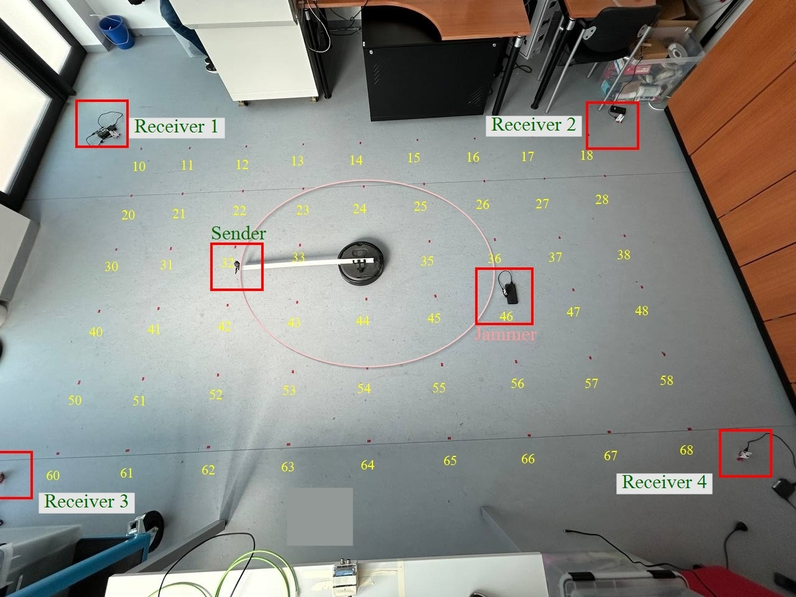

<p align="center">
  
</p>

# Jammer-Loc

This repository accompanies the paper  
**“Machine and Deep Learning for Indoor UWB Jammer Localization.”**

---

## Usage Example

Run the hyperparameter optimization process:

```bash
python hpo.py \
  --task classification \
  --mode actual \
  --framework ml \
  --config config.yaml \
  --trials 50 \
  --study-name my_study
```

1. Models and metrics must be saved by `main.py` in the expected format.  
2. Optuna results are saved to `hpo.db` by default.  
3. All command-line options are defined in `hpo.py` using `argparse`. Refer to that file for descriptions and additional flags.

---

## Classification and Regression on Source and Testing it on the Test Set

To run classification or regression on the source dataset and test it on the test set, you can use:

```bash
python main.py --config config.yaml
```

1. Outputs and metrics will be saved to the directory defined by `cfg.output.directory`.  
2. All model checkpoints and metrics will be saved per model (e.g., `outputs/simple_nn/`).  
3. In the event of a runtime failure, detailed logging information — including structured error messages and stack traces — will be recorded to facilitate systematic debugging and root cause analysis.

---

## Path Setup

Make sure you adjust the paths according to your project structure in the `config.yaml` file.
  

